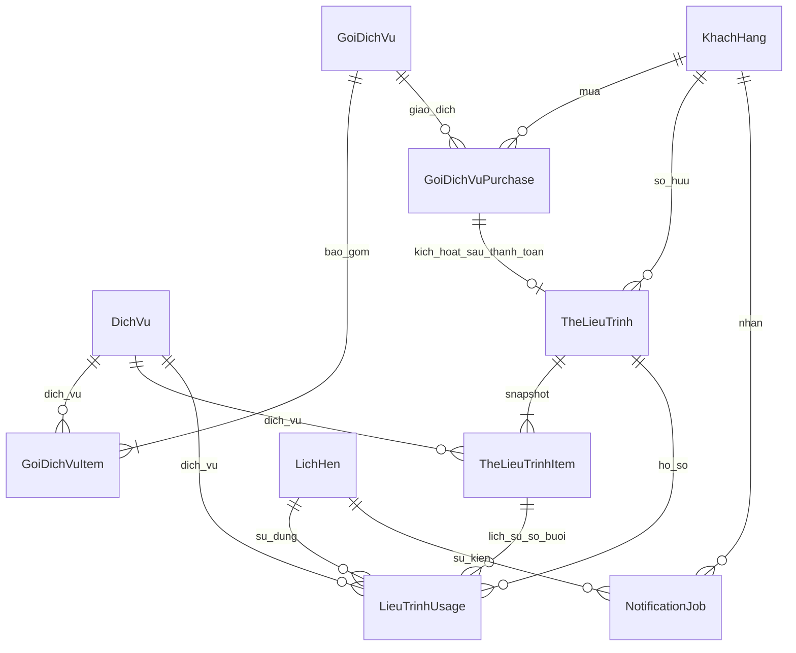

# Giai đoạn 4 — Gói dịch vụ và chăm sóc tự động

`TheLieuTrinh` là **hồ sơ liệu trình / quyền sử dụng gói đã mua**, không phải thẻ điện tử phát cho khách. Thẻ vật lý tại cửa hàng nằm ngoài phạm vi này. Không sửa payroll, attendance, lương, hoa hồng, loyalty hoặc AI.

## Kiến trúc

- `package_service.py`: cấu hình gói, snapshot khi tạo purchase, xác nhận thanh toán, kích hoạt hồ sơ, ledger số buổi, validation và integration point doanh thu.
- `package_bp.py`: API khách hàng/Admin/Manager và các trang `/packages`, `/packages/<magoi>`, `/admin/packages`.
- VietQR helper dùng chung cho `HD<mahd>` và `PKG<purchase_id>`. Webhook SePay có xác thực như trước, dùng `PaymentWebhookEvent` hiện có; không tạo infrastructure thanh toán thứ hai. Package hỗ trợ VietQR và tiền mặt tại quầy; MoMo hiện giữ nguyên luồng hóa đơn.
- Booking reserve và tạo NotificationJob trong cùng transaction với lịch hẹn. Cancel release; complete consume. Hóa đơn chỉ chứa dịch vụ chưa được liệu trình thanh toán.
- `notification_service.py`: outbox DB, claim job bằng UPDATE có điều kiện, worker theo batch, retry hữu hạn. Tái sử dụng `email_service.py` và Resend.
- UI khách: “Gói dịch vụ”, “Liệu trình của tôi”, số buổi đã dùng/giữ/còn khả dụng, lịch sử, mua gói, tiếp tục thanh toán và chọn liệu trình cho từng dịch vụ khi booking.
- UI admin: tạo/sửa/ngừng bán gói; số gói bán và hồ sơ active; giao dịch tiền mặt cần xác nhận; tìm liệu trình theo tên, số điện thoại, mã; nhập dặn dò theo dịch vụ. Không có API hard-delete gói.

## ERD



## Migration và vận hành

Migration **`20261002_0004`**, sau `20261001_0003`:

```powershell
python -m flask --app wsgi:app db upgrade
python -m flask --app wsgi:app db current
```

Migration chỉ thêm bảy bảng và `DichVu.post_care_instructions`. Không reset DB và không xóa migration cũ. Đã kiểm tra upgrade trên DB SQLite tạm chứa dịch vụ cũ. Chưa chạy migration vào DB thật của cửa hàng. Các migration baseline cũ giả định schema gốc đã tồn tại; không dùng `db upgrade` như công cụ tạo lại database trống.

Chạy worker bằng cron/task scheduler mỗi phút, trên cùng DB với website:

```powershell
python -m flask --app wsgi:app process-notification-jobs --batch-size 50
```

Worker kết thúc sau một batch; không sleep dài, không giữ process Flask chờ. Có thể chạy nhiều worker; atomic claim ngăn gửi cùng job đồng thời. Lịch nhắc/job lưu UTC; lịch hẹn và ngày liệu trình dùng giờ Asia/Saigon như luồng booking hiện có.

Biến môi trường mới, không bắt buộc:

```dotenv
PUBLIC_SITE_URL=https://binspa.id.vn
```

Tiếp tục sử dụng `VIETQR_BANK_ID`, `VIETQR_ACCOUNT_NO`, `VIETQR_ACCOUNT_NAME`, `SEPAY_API_KEY`, `RESEND_API_KEY` hiện có. Không đưa credential vào source. SDK Resend được ghim hiện tại chưa hỗ trợ options cho idempotency, nên transport có header được đặt trong chính `email_service.py`, dùng cùng credential và HTML wrapper.

## API

| Method | Endpoint | Quyền / mục đích |
|---|---|---|
| GET | `/api/packages` | Public, gói đang bán |
| GET | `/api/packages/<magoi>` | Public, chi tiết gói đang bán |
| POST | `/api/packages/<magoi>/purchase` | Customer, tạo pending và request VietQR/tại quầy |
| GET | `/api/packages/my-purchases` | Customer, giao dịch của mình |
| GET | `/api/packages/purchases/<id>` | Customer, trạng thái/QR giao dịch của mình |
| GET | `/api/packages/my-treatments` | Customer, hồ sơ của mình |
| GET | `/api/packages/my-treatments/<mathe>` | Customer, hồ sơ và lịch sử của mình |
| GET/POST | `/api/admin/packages` | Admin/Manager, danh sách/tạo gói |
| PUT | `/api/admin/packages/<magoi>` | Admin/Manager, sửa hoặc inactive |
| GET | `/api/admin/packages/treatments?search=...` | Admin/Manager, tìm hồ sơ và lịch sử |
| GET | `/api/admin/packages/purchases` | Admin/Manager, giao dịch mua |
| POST | `/api/admin/packages/purchases/<id>/confirm-payment` | Admin/Manager, xác nhận cash; body `amount` phải đúng số tiền gói |
| PUT | `/api/admin/packages/services/<madv>/post-care` | Admin/Manager, lưu body `instructions` |
| POST | `/api/payment/webhook/sepay` | Webhook hiện có, bổ sung phân biệt PKG/HD |
| POST | `/api/appointments/create` | Customer, bổ sung `package_usages` |

Customer/price/số buổi lấy từ dữ liệu server và JWT; không tin `makh`, `amount`, remaining sessions do frontend gửi khi mua/booking. Các API quản lý gói từ chối tài khoản inactive và kỹ thuật viên/lễ tân.

Booking payload ví dụ:

```json
{
  "madv_list": [3],
  "ngaygio": "2026-10-05T09:00",
  "package_usages": [{"mathe": 12, "madv": 3, "quantity": 1}]
}
```

## Số buổi, thời hạn và tiền

- `available_sessions = total_sessions - consumed - reserved` được tính từ ledger; `released` không trừ buổi. Mỗi lịch hẹn dùng tối đa một buổi cho mỗi dịch vụ, phù hợp `ChiTietLichHen` hiện có.
- Reserve kiểm tra owner, trạng thái, service, số buổi, ngày hiện tại và **ngày hẹn không sau ngày hết hạn**. Ngày hết hạn được sử dụng trọn ngày; giờ trong ngày không làm mất quyền đặt lịch trong ngày cuối. Hiệu lực cộng theo tháng lịch từ kích hoạt; cuối tháng được chặn về ngày cuối hợp lệ.
- Snapshot lưu ngay tại purchase pending; thay đổi gói trước/sau thanh toán đều không đổi điều khoản đã mua. Activation chỉ chạy sau `paid` và idempotent qua `purchase_id UNIQUE`.
- VietQR package yêu cầu đúng amount và giao dịch tiền vào. Reference `PKG...` xử lý riêng trước reference hóa đơn; webhook lặp không tạo thêm record/item hoặc doanh thu.
- Reserve dùng UPDATE khóa record trước khi đọc ledger. Update appointment khóa lịch hẹn; transition chỉ đổi usage `reserved`. DB transaction và UNIQUE `(malh, madv)` ngăn dùng một buổi hai lần. Hai HTTP booking đồng thời trên DB SQLite độc lập đã được kiểm tra.
- Cancel lần hai có thể bị từ chối do lịch đã kết thúc; không thay đổi ledger thêm. Complete lặp không consume thêm. Không mở lại/đổi trạng thái kết thúc lịch có usage liệu trình, tránh giải phóng buổi consumed.
- Không tạo invoice mới cho lịch được liệu trình bao phủ hoàn toàn. Lịch hỗn hợp chỉ tính dịch vụ chưa được bao phủ.
- Doanh thu gói = tổng `GoiDichVuPurchase.amount` với `status=paid`, ghi nhận đúng một lần tại `paid_at`. Redemption không tạo `ThanhToan` hoặc revenue mới. `paid_package_revenue(start,end)` là integration point để cộng vào analytics sau này; biểu đồ analytics cũ vẫn giữ phạm vi doanh thu hóa đơn.
- `TheLieuTrinhItem.unit_value_snapshot` được phân bổ theo tỷ trọng giá lẻ; `regular_price_snapshot`, lịch sử usage, service và appointment tạo dữ liệu cho Commission tương lai. **Không tính commission hoặc sửa salary ở giai đoạn này.**

## Notification và chống gửi trùng

- Confirmed: tạo reminder trước 24h/2h nếu scheduled_at còn tương lai. Hủy/chuyển khỏi confirmed: hủy pending/processing reminders. Đổi thời gian hẹn cập nhật reminder chưa thử gửi và kiểm tra hạn liệu trình.
- Completed: tạo `post_care` ngay và `review_request` sau 2h. Unique key theo appointment/event ngăn event lặp tạo thêm job. Email đánh giá dẫn tới `/profile?review=<malh>#appointments` và form đánh giá GĐ2.
- Due jobs được claim atomically; attempts tăng trước gửi để có thể audit lần gửi bị gián đoạn. Job processing quá 10 phút có thể được phục hồi. Retry sau 5/10 phút; tối đa 3 lần.
- Payload đóng băng từ lần gửi đầu; retry giữ cùng `Idempotency-Key` và body. Với reminder đã thử gửi, reschedule không viết lại body dưới cùng key. Worker không tự retry qua 23h kể từ lần thử đầu: chuyển failed để đối soát, tránh key hết hạn và gửi lần hai. Resend giữ idempotency key 24h: [tài liệu chính thức](https://resend.com/changelog/idempotency-keys).
- Khi cancellation xảy ra đồng thời với HTTP gửi email đã được provider nhận, email có thể đã được gửi; DB không thể thu hồi email. Không phát lại job sent. Không reset failed jobs thủ công khi chưa đối soát kết quả provider.

## Kiểm tra

Baseline trước sửa: **71 pass, 0 fail**. Sau triển khai: **103 pass, 0 fail**; gồm 32 case GĐ4 và regression booking/payment/review/dashboard/availability trước đó. Các warning SQLAlchemy/datetime hiện có vẫn được pytest báo.

```powershell
python -m pytest -q -p no:cacheprovider --disable-warnings
python tests/phase4_ui_check.py
```

Script UI opt-in yêu cầu Chrome và `websocket-client` trong môi trường kiểm tra; không thêm vào dependency runtime của website. Dùng app/database tạm, JWT thử nghiệm, email mocked; không thanh toán hoặc gửi email thật. Chrome kiểm tra pages/control ở 1920, 1440, 1024, 768, 390px. Kết quả JSON và ảnh được sinh trong `tests/runtime_phase4_ui/`.

Checklist trên môi trường staging sau migration:

1. `/admin/packages`: tạo gói một/nhiều dịch vụ; sửa giá/thời hạn; inactive; xác nhận kỹ thuật viên/lễ tân không truy cập API.
2. `/packages` và chi tiết: kiểm tra giá lẻ, giá gói, tiết kiệm, số buổi, thời hạn; mua VietQR hoặc tại quầy. Pending chưa có liệu trình.
3. Thanh toán thử qua sandbox/SePay: sai tiền không kích hoạt; đủ tiền kích hoạt; gửi lặp webhook vẫn một hồ sơ. HD/MoMo cũ vẫn hoạt động.
4. `/profile#treatments`: đúng owner, tên gói, ngày mua/kích hoạt/hết hạn, số used/reserved/available, lịch sử; tiếp tục giao dịch pending.
5. Booking chọn service có liệu trình: chọn sử dụng một buổi hoặc thanh toán bình thường; giá phải trả chỉ gồm dịch vụ không được bao phủ; booking thành công chuyển reserved.
6. Hủy: session trở lại available. Hoàn thành: chuyển consumed một lần; complete lặp không trừ lần hai. Chặn ngày hẹn sau expiry.
7. Worker: future job chưa gửi; due job sent; lỗi retry hữu hạn; hai worker không gửi trùng; cancel hủy reminder; post-care đúng dịch vụ; review link mở lịch phù hợp.
8. Kiểm tra tất cả trang ở năm breakpoint trên, Console không lỗi JS và controls không overlap.

Chrome UI validation: all five breakpoints passed with no JavaScript errors or horizontal overflow. The isolated test database also passed purchase (cash/VietQR), cash confirmation, booking reserve, cancel release, completion consume, usage history, and review form navigation. No real payment or email was sent.

## File mới và file sửa trong GĐ4

Mới: `app/services/package_service.py`, `app/services/notification_service.py`, `app/routes/package_bp.py`, `app/static/css/packages.css`, `app/static/js/packages.js`, `app/templates/customer/packages.html`, `app/templates/admin/packages.html`, `migrations/versions/20261002_0004_packages_and_care.py`, `tests/test_phase4_packages_care.py`, `tests/phase4_ui_check.py`, tài liệu này.

Sửa: `app/models.py`, `app/__init__.py`, `app/config.py`, `.env.example`, `.gitignore`, `app/routes/appointment_bp.py`, `app/admin/appointment_manage_bp.py`, `app/admin/invoice_manage_bp.py`, `app/services/appointment_service.py`, `app/services/email_service.py`, `app/services/vietqr_service.py`, `app/static/js/admin/admin_layout.js`, `app/static/js/customers/appointments.js`, `app/static/js/customers/profile.js`, `app/templates/customer/appointment_create.html`, `app/templates/customer/layout.html`, `app/templates/customer/profile.html`. Các thay đổi GĐ trước được giữ nguyên.

## Giới hạn triển khai / việc vận hành còn lại

- Chưa áp dụng migration hoặc cấu hình cron vào môi trường cửa hàng. Chưa thanh toán/gửi email thật; cần staging với credential đã cấu hình để xác nhận provider delivery.
- Concurrency đã test SQLite nhiều connection và SQL lock dùng được trên PostgreSQL; cần smoke test trên PostgreSQL staging trước deploy.
- Analytics có integration point doanh thu gói; chưa cộng vào biểu đồ cũ theo phạm vi cho phép. Không refund tự động hoặc commission.
- Expired được tính khi đọc/validate (không cần worker cập nhật status hàng loạt). Các API danh sách admin hiện giới hạn 200 hồ sơ/giao dịch gần nhất; tìm kiếm hồ sơ có trên UI.
